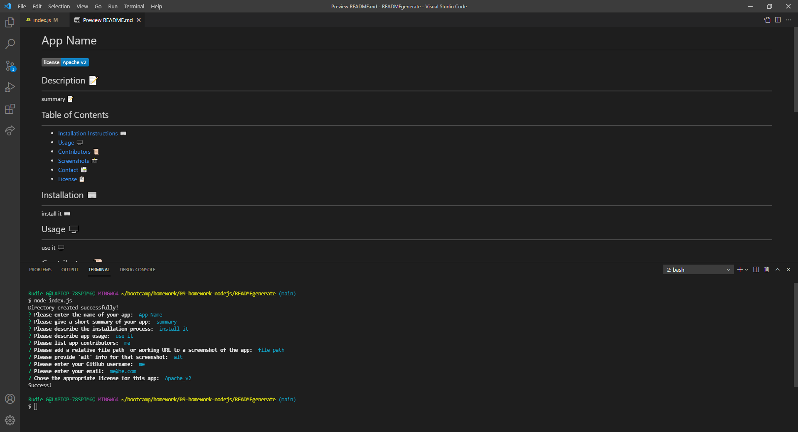

# README Generator
 

## Description 📝 
---
This project is designed using node.js and inquirer, it prompts the user with questions and then populates a template README.md file with the given values, placing it in a created folder called README. Along with the name of the project, a summary, and installation instructions, users may enter a relative screenshot file path as well as choose what license their app is covered under. 📝

## Table of Contents 
--- 
- [Installation ⌨️](#installation-%EF%B8%8F)
- [Usage 🖥️](#usage-️)
- [Contributors 📜](#contributors-)
- [Screenshot & Video 📸](#screenshot--video--click-on-screenshot-to-see-video)
- [Contact 📠](#contact-)
- [License 📋](#license-)

## Installation ⌨️
---
The user will have to use npm i -y and/or npm i inquirer after cloning the repository to install inquirer, otherwise there is no installation! Hooray! ⌨️
  
## Usage 🖥️ 
---
The user can generate multiple README.md files quickly, and the template literal syntax can easily be manipulated to reflect what the user wants their markdowns to look like. The user runs node index.js and answers the prompts, and the file is created in the README folder. The user can then move the file to whatever folder they like, adjusting relative file paths if necessary. This README was generated using the app! 🖥️
  
## Contributors 📜 
---
Rudie G (Rauol Moore) 📜
  
## Screenshot & Video 📸 (click on screenshot to see video)
---

## Contact 📠 
 
GitHub: https://github.com/rudie-g
 
 
Email: rauoldm@gmail.com
 
 

## License 📋

 
This application is covered by <a href=""> no</a> license.
